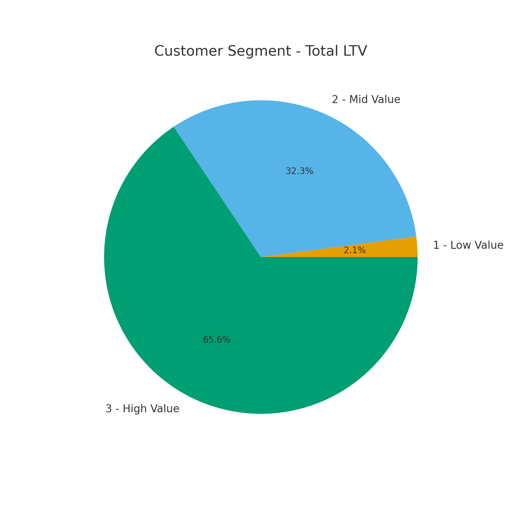
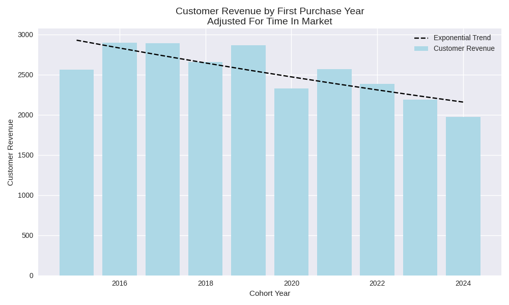
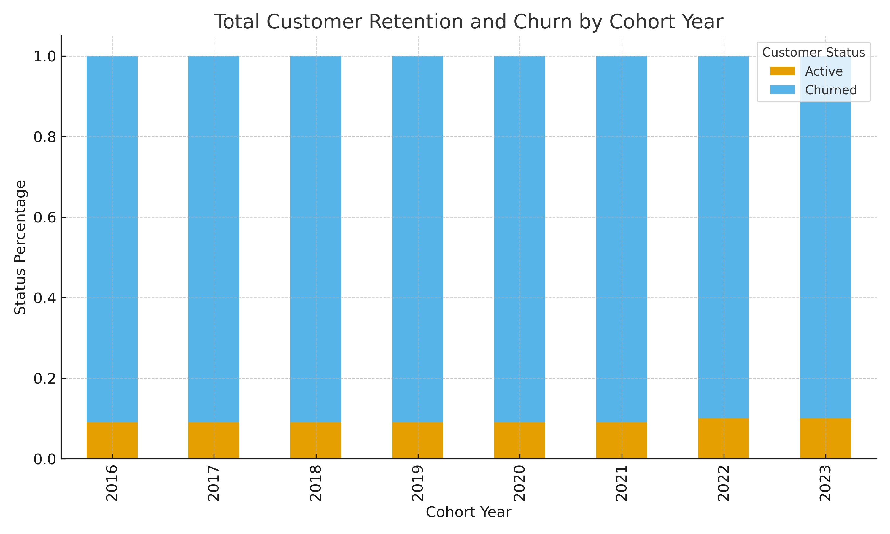

# SQL - Sales Analysis

## Overview
This project performs a SQL sales analysis on customer transaction data to identify key business drivers. It focuses on customer segmentation, cohort behavior, and customer retention trends to provide data-driven recommendations for maximizing customer lifetime value (LTV) and stabilizing long-term revenue.

 

## Business Questions
1. **Customer Segmentation:** How do different customer segments contribute to overall revenue?
2. **Cohort Analysis:** How do different customer groups generate revenue? 
3. **Customer Retention:** What are the current retention and churn rates across different customer cohorts.

 

## Analysis Approach

### 1. Customer Segmentation Analysis
- Categorized customers based on total lifetime value (LTV).
- Assigned customers to High, Mid, Low value segments.
- Calculated key metrics: total revenue.

QUERY: [1_customer_segmentation.sql](./1_customer_segmentation.sql)

**Visualization:**

**Key Findings**
- High value segment (25% of customers) drives 66% of revenue ($135.4M).
- Mid value segment (50% of customers) generates 32% of revenue ($66.6M).
- Low value segment (25% of customers) accounts for 2% of revenue (4.3M).

**Business Insights**
- High value (66% revenue): Offer premium membership program to 12,372 VIP customers, as losing one customer significantly impacts revenue.
- Mid value (32% revenue): Create upgrade paths through personalized promotions, with potential $66.6M to $135.4M revenue opportunity.
- Low value (2% revenue): Design re-engagement campaigns and price sensitive promotions to increase purchase frequency.

 

### 2. Cohort Analysis
- Tracked revenue and customer count per cohorts.
- Grouped customers into cohorts based on year of first purchase.
- Analyzed customer retention at a cohort level.

QUERY: [2_cohort_analysis.sql](./2_cohort_analysis.sql)

**Visualization:**

**Key Findings**
- Revenue per customer shows an alarming decreasing trend over time.
- 2022-2024 cohorts are consistently performing worse than earlier cohorts.
- Although net revenue is increasing, this is likely due to a larger customer base, which is not reflective of customer value.

**Business Insights**
- Value extracted from customers is decreasing over time and needs further investigation.
- In 2023 we saw a drop in number of customers acquired, which is concerning.
- With both lowering LTV and decreasing customer acquisition, the company is facing a potential revenue decline.

 

### 3. Customer Retention Analysis
- Tracked revenue and customer count per cohorts.
- Cohorts were grouped by year of  first purchase.
- Analyzed customer retention at a cohort level.

QUERY: [3_retention_analysis.sql](./3_retention_analysis.sql)

**Visualization:**

**Key Findings**
- Cohort churn stabilizes at ~90% after 2-3 years, indicating a predictable long term pattern.
- Retention rates are consistently low (8-10%) across all cohorts, suggesting retention issues are systemic rather than specific to certain years.
- Newer cohorts (2022-2023) show similar churn trajectories, signaling that without intervention, future cohorts will follow the same pattern.

**Business Insights**
- Strengthen early engagement strategies to target the first 1-2 years with onboarding incentives, loyalty rewards, and personalized offers to improve long-term retention.
- Re-engage high value churned customers by focusing on targeted win-back campaigns rather than broad retention efforts, as reactivating valuable users may yield higher ROI.
- Predict & preempt churn risk and use customer specific warning indicators to proactively intervene with at risk users before they lapse.

 

## Strategic Recommendations
1. **Customer Value Optimization** (Segmentation)
- Launch a VIP loyalty program for the 12,372 high-value customers who generate 66% of revenue.
- Create personalized upgrade and cross-sell paths for mid-value customers to unlock the $66.6M–$135.4M revenue opportunity.
- Design price-sensitive re-engagement promotions for low-value customers to increase purchase frequency and lift overall LTV.

2. **Cohort Performance Strategy** (Cohort Revenue)
- Prioritize the 2022–2024 cohorts with tailored offers and re-engagement campaigns to address declining revenue per customer.
- Introduce loyalty or subscription programs to create stable, predictable revenue and improve long-term value.
- Replicate successful behaviours and incentives seen in the high-performing 2016–2018 cohorts to improve newer cohort performance.
- Investigate acquisition channels for the 2023 cohort to identify why customer volume dropped.

3. **Retention & Churn Prevention** (Customer Retention)
- Strengthen the first 1–2 years of onboarding and engagement, where churn risk is highest—using incentives, loyalty rewards, and personalized messaging.
- Use targeted win-back campaigns for high-value customers who have churned, maximizing ROI compared to broad retention efforts.
- Build a proactive churn-prediction system using behavioral indicators to intervene before customers lapse.

 

## Conclusion

The analysis shows that revenue is heavily concentrated among a small group of high-value customers, while newer cohorts are generating less value and dropping off sooner. Despite growing customer numbers, most cohorts follow the same pattern—strong early activity followed by rapid churn.

To drive sustainable growth, the business must improve the quality of customer acquisition and strengthen early retention. Focusing on high-value customers, improving onboarding, and targeting the right channels will increase lifetime value and reduce dependency on a shrinking top segment

 

## Technical Details
- **Database:** PostgreSQL
- **Analysis Tools:** SQL queries executed in PostgreSQL, DBeaver & PGadmin
- **Visualization:** Generated using external tools - ChatGPT & Microsoft Copilot.
